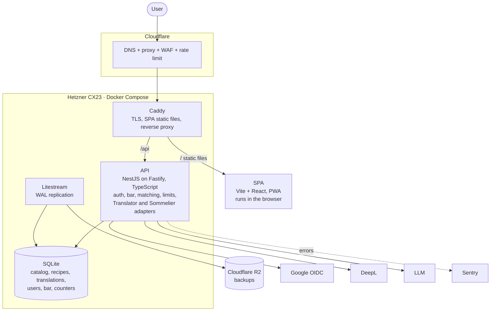

# BarBro — documentation

BarBro is a web app for the home bar: you keep a list of the bottles and ingredients you have, see which cocktails you can make right now from a database of real, verified recipes, and ask for a recommendation for a mood, an occasion or a dish. That last step is the only place an LLM is involved, and it can only choose among cocktails you can already make — it never invents a recipe. Built for someone who likes making cocktails at home; the first product of a Solution Architect portfolio program, training the Data / AI dimension.

## Documents

| Document                             | What it is                                                                       |
|--------------------------------------|----------------------------------------------------------------------------------|
| [`requirements.md`](requirements.md) | Problem, users, scenarios, MVP scope, functional and non-functional requirements |
| [`architecture.md`](architecture.md) | C4 Context and Container diagrams, key flows, data model, deployment             |
| [`adr/`](adr/README.md)              | Architecture decision records, one file per decision                             |
| [`threat-model.md`](threat-model.md) | STRIDE over the data flows: assets, boundaries, threats and controls             |
| [`repos.md`](repos.md)               | The product's repositories and what lives in each                                |
| [`STATE.md`](STATE.md)               | Current phase, milestone, decisions and next step                                |

Code lives in the [`barbro`](repos.md) monorepo.

## Status

Phase 2 (architecture) is closed; phase 3 (implementation) starts with milestone M0 "Skeleton". See `STATE.md`.
