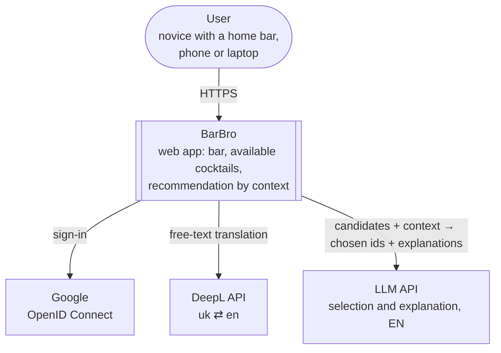
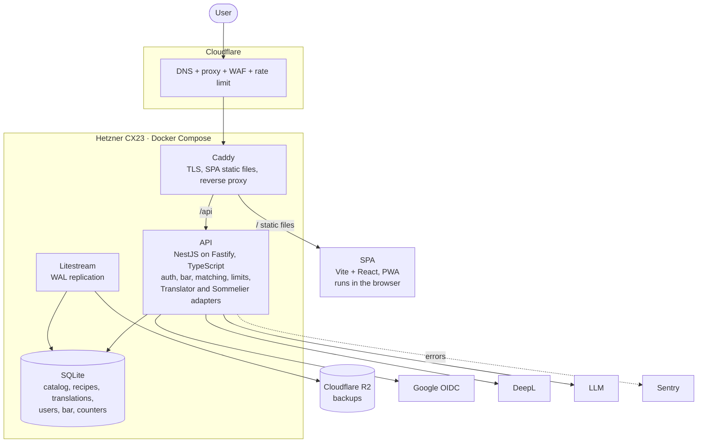
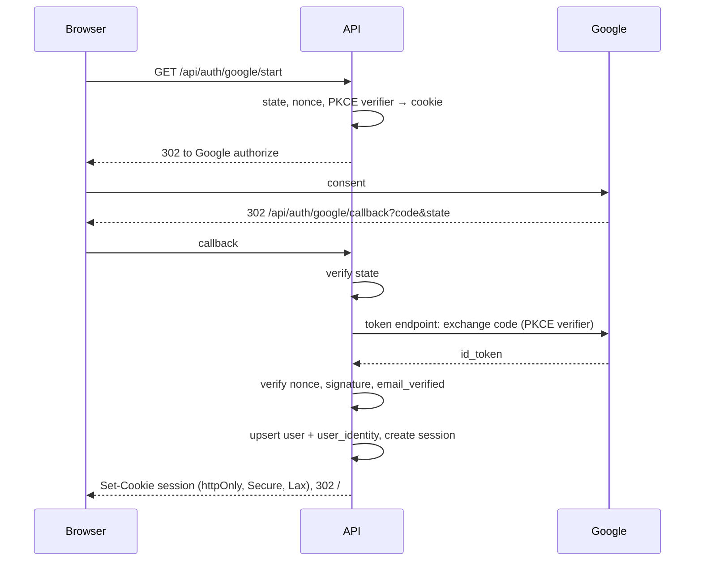
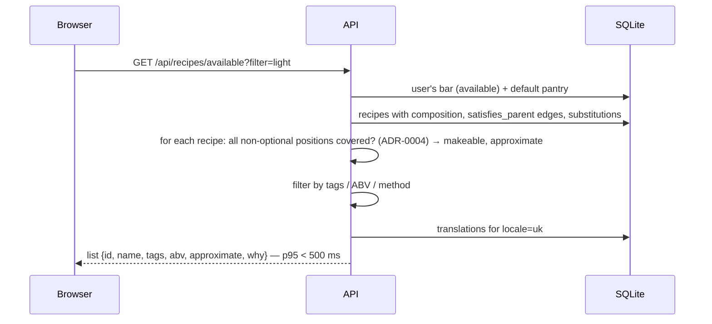
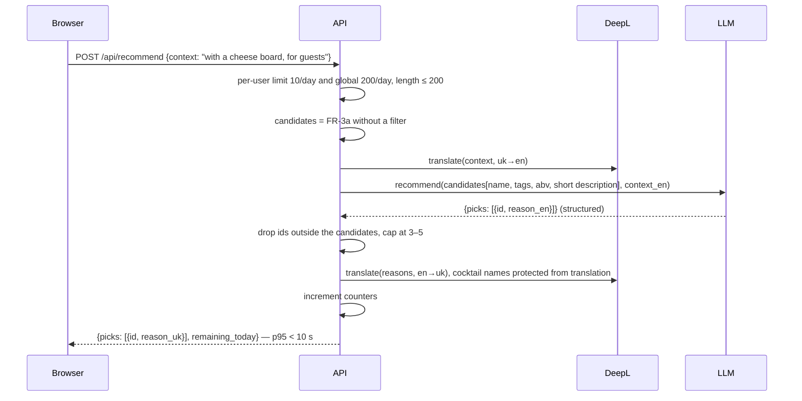
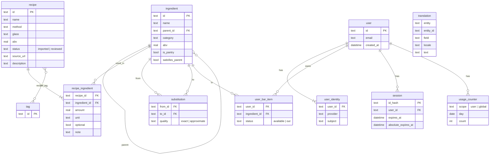
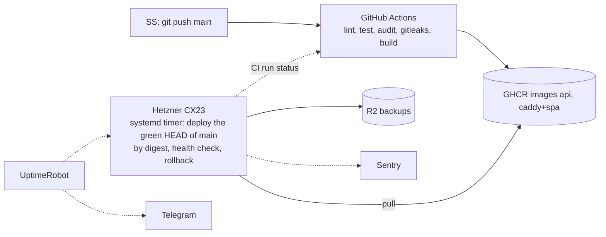

# BarBro: Architecture

Updated: 2026-09-26
Status: expert council review passed 2026-09-26; revisions applied
Decisions: ADR-0001 … ADR-0006; threats and controls — `threat-model.md`.

## 1. Context (C4 Context)

BarBro has no inbound integrations: nobody calls its API except its own frontend. All three external systems are outbound, keyed, and none is required for FR-3a: the list of available cocktails works even if DeepL and the LLM are down.

## 2. Containers (C4 Container)

| Container  | Responsibility                                                                                                                                                                                                                                                                                                          | Technology                                       |
|------------|-------------------------------------------------------------------------------------------------------------------------------------------------------------------------------------------------------------------------------------------------------------------------------------------------------------------------|--------------------------------------------------|
| SPA        | Screens: sign-in, bar, available cocktails with filters, recommendation by context, recipe, account. Server state — TanStack Query; PWA for "add to home screen". Renders explanations as plain text only.                                                                                                              | Vite, React, TanStack Query, Tailwind, shadcn/ui |
| API        | The single public entry point. Modules: `auth` (OIDC, sessions), `catalog` (ingredients, tree, search), `bar` (the user's bar), `recipes` (recipes, matching, filters), `recommend` (FR-3b: limits, Translator, Sommelier, response validation), `i18n` (translations by locale). OpenAPI is generated from decorators. | NestJS + Fastify adapter, Drizzle, Zod           |
| SQLite     | A single database file in a Docker volume; WAL mode.                                                                                                                                                                                                                                                                    | better-sqlite3                                   |
| Litestream | Continuous WAL replication to R2; snapshot before a migration.                                                                                                                                                                                                                                                          | Litestream                                       |
| Caddy      | TLS (Cloudflare origin certificate), security headers (CSP, HSTS), SPA static files, proxying `/api` → API.                                                                                                                                                                                                             | Caddy                                            |

Adapters are the boundary for swapping providers without touching the modules:

- `Translator.translate(text, from, to) → text` — DeepL implementation; Azure/Google — by configuration.
- `Sommelier.recommend(candidates, context) → {picks: [{id, reason}]}` — implementation on the official SDK of the chosen model; model and provider — configuration; structured output; `max_tokens`; reasoning off.

## 3. Key flows

### 3.1 Sign-in via Google

### 3.2 "What to make now" (FR-3a, deterministic)

Matching is computed on every request: 663 recipes × ~5 positions — milliseconds in memory; no cache needed. The same code with a counter of uncovered positions gives S4 after release.

### 3.3 Recommendation by context (FR-3b)

Order matters: counters are incremented **after** successful paid calls, but the global check happens before them; on a DeepL or LLM error the user gets a clear response and the quota is not consumed.

## 4. Data model

Reference tables (`ingredient`, `recipe`, `recipe_ingredient`, `tag`, `substitution`, `translation`) are populated by a seed script from Bar Assistant data (ADR-0001) with the edge and substitution audit (ADR-0004) and the nomenclature translation (ADR-0003); they are versioned together with the code. User tables are only `user`, `user_identity`, `session`, `user_bar_item`, `usage_counter`; account deletion is a single transaction over them. Pantry: no `user_bar_item` row for an `is_pantry` ingredient = available, `status = out` = disabled by the user. `usage_counter` counters reset at midnight UTC (02:00–03:00 Kyiv time) — the UI shows the reset time.

## 5. Deployment and operations

- One compose file: `caddy`, `api`, `litestream`; a volume for SQLite; secrets in `.env` with mode 600.
- Deploy is pull-based (ADR-0007): every 5 minutes a systemd timer on the server takes the HEAD of `main` whose CI run
  succeeded, resolves the `sha-<commit>` tags of both images to digests, fetches `infra/` of the same commit, and runs `docker
  compose up -d` pinned by digest; a health check rolls back to the previous digests on failure; CI has no access to the
  server. Manual rollback or freeze — a pin file with the SHA.
- Monorepo `barbro`: `apps/api`, `apps/web`, `packages/shared`, `infra/`; documentation — `barbro-docs`.
- Hetzner firewall: 22 open to the internet with key-only authentication (accepted risk, see the threat model); 80/443
  from Cloudflare ranges.
- Drizzle migrations run at `api` start-up after a Litestream snapshot.
- Logs: pino → stdout → Docker `local` log driver (rotated by size, compressed); errors → Sentry.
- Restore: `litestream restore` into an empty volume — the procedure is in `runbook.md`, verified in phase 5.

Cost: server ≈ €6, domain ≈ $1.5, DeepL $0 until the 1 million characters are exhausted, LLM ≈ $0.5–3 — ≈ $9–11 per month in total.

## 6. Deliberately absent

Cache, queues, a separate worker, a second replica, a managed DB, an LLM gateway, streaming — each has a price in complexity that the NFRs do not justify. Each has a clear path to appear if phase 6 brings the corresponding requirement.
