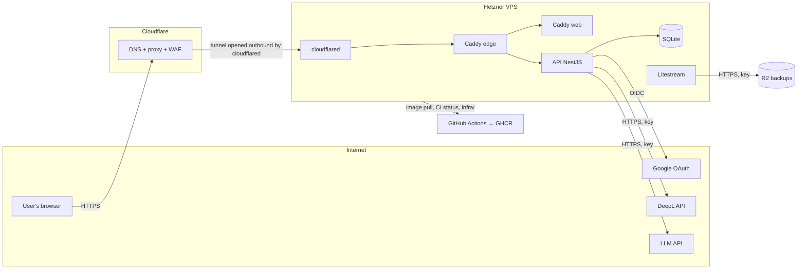

# BarBro: Threat model

Updated: 2026-10-04
Method: STRIDE by hand over the data flows; no tool used — the system has six components.

## 1. What we protect

In order of importance:

1. **Budget** — the LLM and DeepL quotas. The only asset whose loss costs money, and the only one that attracts automated abuse.
2. **Secrets** — the LLM provider key, the DeepL key, the Google OAuth client secret, the server's SSH key, the R2
   token, the Cloudflare Tunnel token. GHCR packages are public: the server pulls anonymously and holds no GitHub or GHCR token.
3. **Personal data** — email, Google `sub`, bar contents, the context text (it goes to DeepL and the LLM).
4. **The server** — as a resource for someone else's mining or spam after a compromise.
5. **Availability** — 99%, one server; the real price of downtime is reputation, not money.

Not specifically protected: the recipe database (public data, MIT) and the code (public repo).

## 2. Trust boundaries

Boundaries: browser ↔ API (the single public entry point); API ↔ external services (our keys outbound, foreign data inbound); CI ↔ server (deploy).
The server accepts no inbound HTTP at all: web traffic arrives through a Cloudflare Tunnel that `cloudflared` opens outbound from the server (ADR-0006, amendment of 2026-10-04); the only inbound port is 22. Deploy is pull-based: the server fetches images from GHCR itself; CI has no access to the server.

## 3. Threats and controls

### 3.1 Budget exhaustion (denial of wallet)

| Threat                                                                                    | Control                                                                                                                                                                                                                                                     | Where                                               |
|-------------------------------------------------------------------------------------------|-------------------------------------------------------------------------------------------------------------------------------------------------------------------------------------------------------------------------------------------------------------|-----------------------------------------------------|
| Mass account registration to bypass the 10/day limit                                      | Sign-in only via Google (ADR-0005) — an account has a non-zero price; rate limit on OAuth start: 10/h per IP (tentative figure, refine at implementation)                                                                                                   | API                                                 |
| Per-IP rate limiting behind the proxy sees only Cloudflare's IP — one bucket for everyone | The edge Caddy takes the client IP from `CF-Connecting-IP` only when the request comes from the `tunnel` container (`trusted_proxies`), and Fastify's `trustProxy` trusts only the edge; a test that two clients with different IPs get different buckets   | API                                                 |
| One user or a script with a valid session hammers FR-3b                                   | 10/day per-user limit, a counter in the DB with a UTC reset date; rate limit 1 request/5 s per user                                                                                                                                                         | API                                                 |
| Total load exceeds the ceiling                                                            | **Global daily FR-3b limit of 200 requests** — beyond it the feature answers "today's quota is exhausted" rather than paying; a counter in the DB; the limit is lowered further when the translator's remaining quota (`/v2/usage`) is below the daily need | API                                                 |
| The provider bills more than expected (reasoning tokens, long output)                     | `max_tokens` per response; reasoning off; a spend limit in the LLM provider's console; DeepL `/v2/usage` in monitoring, alert at 80%                                                                                                                        | adapter config, provider consoles, UptimeRobot/cron |
| API key leak → someone else's spend                                                       | Keys only in `.env` on the server with mode 600 and in GitHub Secrets; gitleaks in CI; rotation on any suspicion; the spend limit as the emergency stop                                                                                                     | CI, server                                          |

### 3.2 Prompt injection and unsafe LLM output

| Threat                                                                                                                                                         | Control                                                                                                                                                                                                                                                                 | Where                    |
|----------------------------------------------------------------------------------------------------------------------------------------------------------------|-------------------------------------------------------------------------------------------------------------------------------------------------------------------------------------------------------------------------------------------------------------------------|--------------------------|
| Through the context field the user makes the LLM ignore instructions, "recommend" a cocktail outside the list, reveal the system prompt or emit unrelated text | The LLM sees only candidates and context; **structured output** `{picks: [{id, reason}]}`; **ids are validated against the candidate list on the backend** — a foreign id is dropped; context capped at 200 characters; the LLM has no tools; `reason` is length-capped | `Sommelier` adapter      |
| LLM or DeepL output contains HTML/script → XSS                                                                                                                 | Explanations are rendered as plain text only (React escapes by default; no `dangerouslySetInnerHTML`, no markdown renderer); CSP without `unsafe-inline`                                                                                                                | SPA, Caddy headers       |
| Offensive or inappropriate content in an explanation                                                                                                           | The system prompt constrains the topic; a "report" button — after MVP; risk accepted                                                                                                                                                                                    | —                        |
| The context contains personal data that goes to DeepL and the LLM                                                                                              | The privacy policy names both as processors; a UI hint "do not enter personal data"; the context is not logged in the clear                                                                                                                                             | UI, logs, privacy policy |

### 3.3 Authentication and sessions

| Threat                                                             | Control                                                                                                                                                                                                          | Where    |
|--------------------------------------------------------------------|------------------------------------------------------------------------------------------------------------------------------------------------------------------------------------------------------------------|----------|
| CSRF on the OAuth callback, account substitution                   | `state` (random, in a cookie, verified) + PKCE + `nonce` in the id_token                                                                                                                                         | API      |
| Session theft or fixation                                          | Cookie `httpOnly; Secure; SameSite=Lax`; the session identifier has 256 bits of randomness, its hash is stored; id rotation on sign-in; 30-day sliding lifetime, 90-day absolute; logout invalidates server-side | API      |
| CSRF on state-changing requests (add a bottle, delete the account) | `SameSite=Lax` + a mandatory custom header on mutations (`X-Requested-With`) — cross-origin forms cannot set it; CORS only for our own origin                                                                    | API      |
| Unverified email from Google                                       | Only `email_verified = true` is accepted                                                                                                                                                                         | API      |
| Account deletion by mistake or by a hostile script                 | Confirmation in the UI; hard deletion in a single transaction; the session is destroyed                                                                                                                          | API, SPA |

### 3.4 Server and deploy

| Threat                                                                | Control                                                                                                                                                                                                                                                                                                | Where              |
|-----------------------------------------------------------------------|--------------------------------------------------------------------------------------------------------------------------------------------------------------------------------------------------------------------------------------------------------------------------------------------------------|--------------------|
| SSH brute force                                                       | Keys only (ed25519); `PasswordAuthentication no`, `KbdInteractiveAuthentication no`, `PermitRootLogin no`, `AllowUsers ss`; port 22 is open to the internet (see accepted risks); fail2ban is not used — with key-only authentication brute force cannot succeed, fail2ban would only reduce log noise | Hetzner, sshd      |
| Pre-auth vulnerability in OpenSSH                                     | `unattended-upgrades` with the Debian-Security origin; no exposure reduction by source IP — accepted risk                                                                                                                                                                                              | server             |
| Direct access to the origin bypassing Cloudflare                      | No inbound HTTP ports: web traffic arrives only through the Cloudflare Tunnel, an outbound connection from `cloudflared`; the Hetzner firewall allows only 22; host ports of `edge`, `web` and `api` are bound to `127.0.0.1`                                                                          | Hetzner, Compose   |
| Tunnel token leak → a foreign connector receives part of the traffic  | The token only in `/etc/barbro/tunnel-token` (root-owned, readable by the container's group), mounted as a Compose secret, never in an environment variable, the repo or logs; the Cloudflare dashboard lists connected connectors; rotation on any suspicion                                          | server, Cloudflare |
| Cloudflare account takeover → domain, DNS and tunnel at once          | Registrar, DNS and tunnel share one account by design (ADR-0006); two-factor authentication on the account                                                                                                                                                                                             | Cloudflare         |
| Vulnerabilities in the OS and dependencies                            | `unattended-upgrades`; Renovate for pnpm and base images; `pnpm audit` in CI (blocks high/critical); images pinned by digest                                                                                                                                                                           | server, CI         |
| CI compromise → deploying foreign code                                | Images are published only from `main`; a protected branch with required CI; the server deploys only the HEAD of `main` whose CI run succeeded, resolves its `sha-<commit>` tags to digests once and runs exactly those digests (ADR-0007); CI has no access to the server whatsoever                   | GitHub, server     |
| Image replaced behind a `sha-<commit>` tag (leaked GHCR write access) | Only CI on `main` and SS's account can push; accepted for now — hardening path: signed GitHub artifact attestations verified before deploy (ADR-0007)                                                                                                                                                  | GHCR, server       |
| Container running as root                                             | A non-root user in the Dockerfile or in Compose; read-only fs except the SQLite volume; `cap_drop: ALL` (the edge keeps `NET_BIND_SERVICE`, required to execute the official Caddy binary); no `--privileged`                                                                                          | Compose            |
| Leak through logs                                                     | pino without request bodies; email and context are masked; Sentry `sendDefaultPii: false`, scrubbing; 14-day log rotation                                                                                                                                                                              | API, Sentry        |

### 3.5 Data and backups

| Threat                                  | Control                                                                                                                                                                                                                                                                                                             | Where      |
|-----------------------------------------|---------------------------------------------------------------------------------------------------------------------------------------------------------------------------------------------------------------------------------------------------------------------------------------------------------------------|------------|
| Loss of SQLite (disk, failed migration) | Litestream to R2 continuously; a snapshot before every migration; **restore is verified in phase 5** — without that the backup does not exist                                                                                                                                                                       | server, R2 |
| Backup leak from R2                     | A private bucket, a separate token scoped to this bucket only; Litestream encryption (age) — optional, decide at implementation                                                                                                                                                                                     | R2         |
| GDPR: deletion or export request        | Deletion — FR-1; export — JSON of the bar on request, manually (the volume does not justify automation); backups are overwritten under a 30-day retention — state this in the privacy policy. Processors for the privacy policy: Google, DeepL, Azure, the LLM provider, Hetzner, Cloudflare (proxy and R2), Sentry | process    |

### 3.6 Availability

| Threat                                     | Control                                                                                                                                                                                            | Where               |
|--------------------------------------------|----------------------------------------------------------------------------------------------------------------------------------------------------------------------------------------------------|---------------------|
| DDoS / L7 flood                            | Cloudflare proxy + a rate limiting rule on `/api/*`; the API rate limit as the second layer                                                                                                        | Cloudflare, API     |
| Server or process crash                    | Docker `restart: unless-stopped`; UptimeRobot → Telegram; one server — 99%, accepted in the NFRs                                                                                                   | Compose, monitoring |
| Tunnel down while the services are healthy | The deploy agent checks through the edge on localhost and does not see the tunnel; until UptimeRobot (phase 5) checks `https://barbro.dev` from outside, this is noticed by hand — accepted for M0 | monitoring          |
| DeepL or LLM outage                        | FR-3b returns a clear error, FR-3a works independently; 15 s timeout, no retries on paid calls                                                                                                     | adapters            |
| A broken release reaches the server        | The deploy agent checks that both services report the target revision; on failure it rolls back to the previous digests and marks the revision bad (ADR-0007)                                      | server              |

## 4. Accepted risks

- One server without failover — per the NFRs.
- Ingress depends on Cloudflare entirely (Cloudflare Tunnel, ADR-0006): a Cloudflare outage takes the site down.
- Dependency on Google for sign-in — ADR-0005.
- Moderation of LLM explanations — the system prompt only; reports — after MVP.
- Client-side backup encryption — decided at implementation; R2 encrypts at rest.
- The public repo reveals the limit logic — security through obscurity is not a control; the limits work with full knowledge of the code.
- SSH port 22 open to the internet. SS's IP is dynamic, so a source-IP rule would need updating on every change.
  Residual risk: a pre-auth vulnerability in OpenSSH (e.g., CVE-2024-6387) is exploitable until the Debian security
  update lands; key-only authentication does not mitigate it.

## 5. What goes into implementation

The controls in the tables above are the backlog for the phase 3 milestones: rate limits and counters (M1, together with auth), validation of LLM ids and CSP (M2, together with FR-3b), firewall, non-root, Litestream, Renovate (M1, together with CI/CD). Every control has a test or a verifiable procedure; restore from backup is the phase 5 exit criterion.

## 6. Open question for Legal

A public site about alcohol for an audience in Ukraine: is an 18+ confirmation required at entry? This is compliance, not threat modelling; decide before release, together with the privacy policy.
